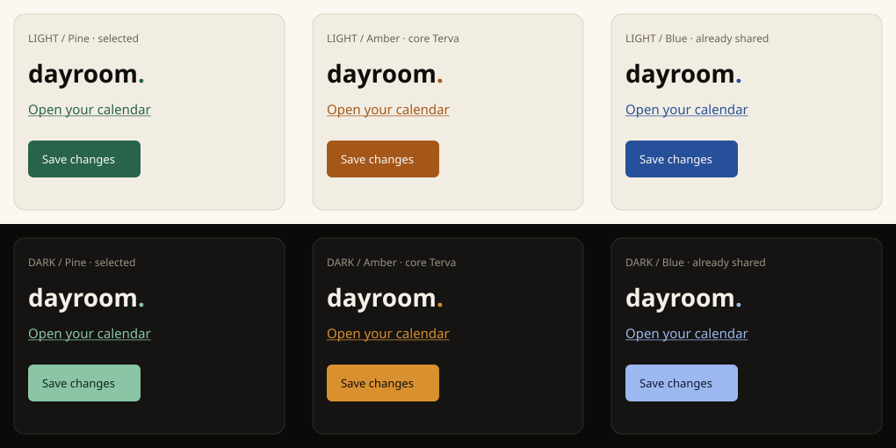

# Dayroom accent

Dayroom adopts pine green for its own accent. The shared Birch/Tar grounds,
text, and scales remain unchanged. The wordmark stays `dayroom.`.

Pine retains the welcoming green association of Dayroom’s initial UI without
tinting every surface green. Terva amber was a useful temporary adoption preset,
but it identifies the core Terva app. Blue was rejected because lampi, ketju,
and git-ticket-canvas already occupy that part of the palette.

## Measured contrast

| Scheme | Accent / hover / text on accent | Minimum accent on grounds | Minimum text on accent or hover |
| --- | --- | --- | --- |
| light | #28634B / #1F4D3A / #FBF8F2 | 6.04:1 | 6.66:1 |
| dark | #8BC5A6 / #B0DCC4 / #10251B | 8.61:1 | 8.17:1 |

The shared test suite checks every existing app as well as Dayroom, including
hover moving away from the ground. The additive preset does not change other
apps or rename shared roles. Samples below use the shared UI font and grounds.
