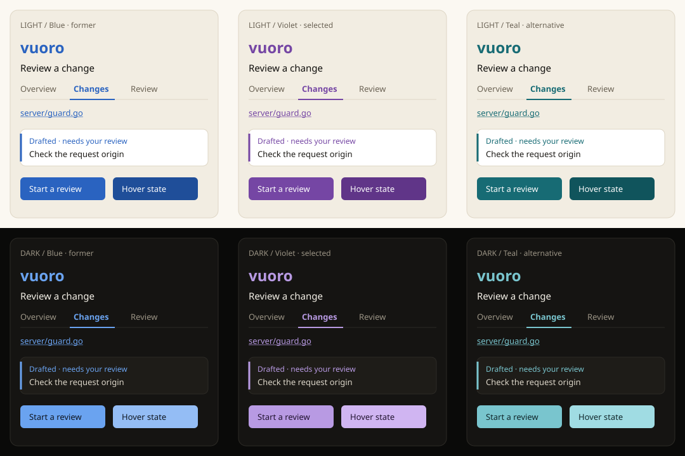

# Vuoro accent review

Vuoro is the desktop front door to code review. Its owner chose **violet** on
2026-10-02, replacing the temporary git-ticket-canvas blue preset. Its
components read the shared `--ui-*` roles; the Birch/Tar grounds, status
colors, and scales stay shared. The chosen roles live in `accents.vuoro` in
`tokens.json` and export with `-app vuoro`.

Open the [interactive review](vuoro-accent.html) to switch accent and scheme
on a larger example using vuoro's component styling. It includes links,
primary actions, active tabs, drafted findings, severity badges, diff fills,
and keyboard focus. The controls use sample data and never contact a forge.

## Choice and alternatives

**Violet** gives vuoro a recognizable accent without occupying the blue range
already used by lampi, ketju, and git-ticket-canvas, or Dayroom's pine/mint
range. It also stays separate from the shared green, amber, and red status
colors used to review findings. The warm Birch and Tar foundations, status
colors, and scales remain the same.

**Blue** is accessible, familiar, and was already in use. There is no contrast
reason to replace it. Its limitation is identity: it is exactly
git-ticket-canvas's accent, inherited as a placeholder rather than chosen for
vuoro.

**Teal** is accessible and quieter than violet. It is closer to Dayroom's
green and the shared success color, which gives it less separation in a
review screen with approval marks and added diff lines.

## Roles and measured contrast

Contrast uses WCAG relative luminance. The grounds column is the minimum of
both accent and hover against `bg`, `surface`, and `raised`. The button text
column is the minimum of `on-accent` against accent and hover. Every candidate
exceeds 4.5:1, and hover moves away from the ground in both schemes.

| Candidate | Scheme | Accent | Hover | Text on accent | Minimum on grounds | Minimum button text |
| --- | --- | --- | --- | --- | --- | --- |
| Blue, former | Birch | #2A63C0 | #1F4E99 | #FFFFFF | 4.94:1 | 5.76:1 |
| Blue, former | Tar | #6AA3F0 | #94BDF5 | #0E1520 | 6.57:1 | 7.07:1 |
| Violet, selected | Birch | #7546A4 | #603588 | #FFFFFF | 5.68:1 | 6.63:1 |
| Violet, selected | Tar | #B89AE3 | #D0B5F2 | #20122F | 7.10:1 | 7.38:1 |
| Teal, alternative | Birch | #176B74 | #10545C | #FFFFFF | 5.30:1 | 6.19:1 |
| Teal, alternative | Tar | #79C5CE | #A0DCE3 | #10262A | 8.66:1 | 8.02:1 |

The soft fill remains the foundation's 14% accent mixed into the page
background. Focus uses the accent. Neither is a separate hand-picked color.

## Adoption

`dist/vuoro.css` is generated from the selected roles. The shared test suite
checks every app in both schemes, including contrast and hover moving away
from the ground. Publish a design version containing vuoro before it pins
the module and adds the export `-check` to its local and CI gates.

The HTML and SVG are review snapshots, like the Dayroom samples. They do not
track later token changes automatically; `tokens.json` is the source.
